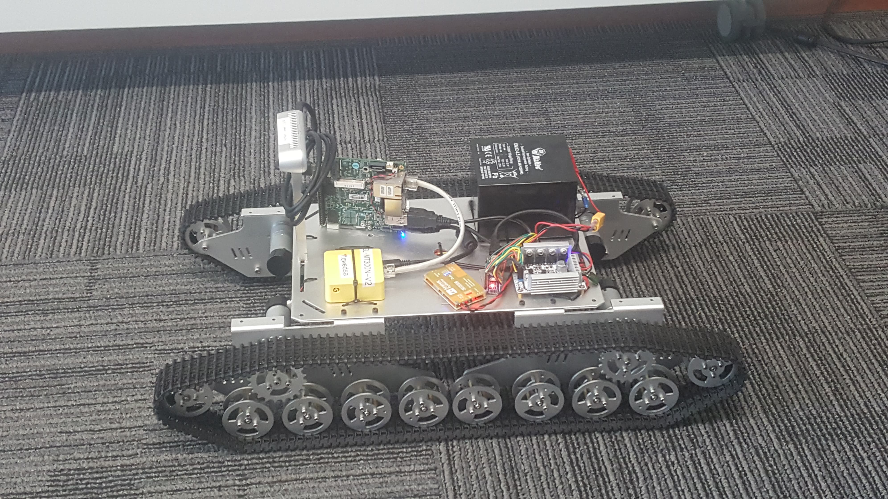

# Landrov



## Running Examples

Examples are found in the `./examples` directory.

To run the examples, firstly [power on the rover](#Powering-Landrov) and [connect to the rovers network](#Connecting-to-the-network). These examples are a good starting point for working with the rover.

### Keyboard Control Example

The rover can be controlled with a keyboard by running `keyboard_control.py`. The controls are:
 - `W` - Forward
 - `A` - Left
 - `D` - Right
 - `S` - Backwards

### Sensor Example

Running `client_example.py`, the rover will navigate in a set circuit for a few seconds and display `RGB` and `Depth` sensor data. The sensor data can also be seen by running `view_sensors.py`.

### Webapp Control Example

A web application will start on the rover when it is turned on. This is designed to be used on a mobile phone. Navigate to `192.168.8.106:8080/static/web_joy.html` on a browser. The rover can be controlled with the two joysticks.

## Powering Landrov

Connect the 12V lead acid battery pack to the Landrov. The rover will beep 3 times to indicate that it is on. It will take a few seconds for the network to start up. If the rover does not beep three times, the battery may need charging.

## Controlling Landrov

### Connecting to the network

To control the Landrov, you must connect to it over wifi. 
- The network will appear as `landrov1` 
- The password to the network is `11qwedsa`

Once connected you can begin sending commands to and recieving datafrom the rover.

### Recieving Data

To receive data from the D435 sensor, you must subscribe to the correct sockets on the rover. The Landrov has three different sensor sockets that can be subsribed to:

- `rgbimage` - An RGB image from the D435.
- `depthimage` - A depth image from the D435.
- `pointcloud` - A streamed String of pointcloud data from the D435.

An example of subscribing to all of the sensor sockets follows.

```
context = zmq.Context()
sensor_socket = context.socket(zmq.SUB)
sensor_socket.connect("tcp://192.168.8.106:5557")
sensor_socket.setsockopt(zmq.SUBSCRIBE,b'depthimage') 
sensor_socket.setsockopt(zmq.SUBSCRIBE,b'rgbimage') 
sensor_socket.setsockopt(zmq.SUBSCRIBE,b'pointcloud')
```

The data can then be recieved as follows:

```
if len(zmq.select([sensor_socket],[],[],0)[0]):
        topic,buf = sensor_socket.recv_multipart()
        if topic == b'rgbimage':
            img = np.fromstring(buf, dtype=np.uint8)
        if topic == b'depthimage':
            depth = cv2.imdecode(np.fromstring(buf, dtype=np.uint8), cv2.IMREAD_GRAYSCALE) 
        if topic == b'pointcloud':
            np_pcd = np.fromstring(buf, dtype=np.float32)
            num_points = np_pcd.size // 3
            reshaped_pcd = np.resize(np_pcd, (num_points, 3))
            pcd = o3d.geometry.PointCloud()
            pcd.points = o3d.utility.Vector3dVector(reshaped_pcd)
```

### Sending Commands

To control the landrov, you must subscribe to the control socket as follows:

```
context = zmq.Context()
control_socket = context.socket(zmq.PUB)
control_socket.connect("tcp://192.168.8.106:5556")
```
Once connected to the socket, commands can be sent to control the motors as follows:

```
cmd = (leftMotorSpeed, rightMotorSpeed)
control_socket.send_multipart([b'motor',pickle.dumps(cmd,0)])
```
The `leftMotorSpeed` and `leftMotorSpeed` should be floats [0, 1].

## Changing Code on Landrov

The code running on the rover should not need to be changed for most uses. However, this may be necessary for more advanced applications.

### SSH into rover

To change the code running on the rover, use SSH as follows:

1. [Connect to the network](#Connecting-to-the-network)
2. SSH into the rover with:
    - SSH: `ssh upsquared@192.168.8.106`
    - password: `1qwedsa`
3. Edit necessary files.
4. Run `runtmux.sh` to rerun all processes and apply changes.